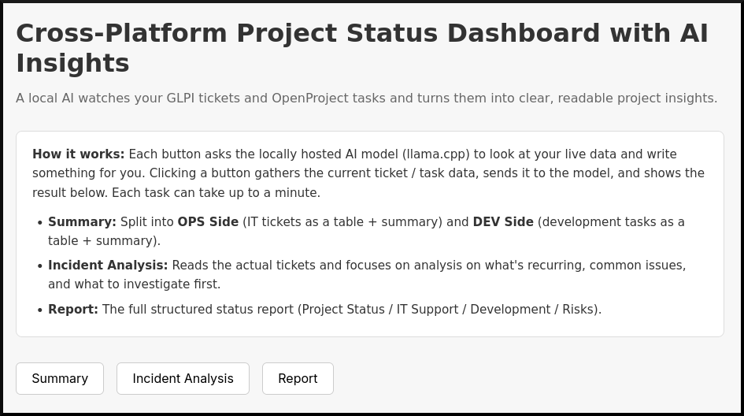
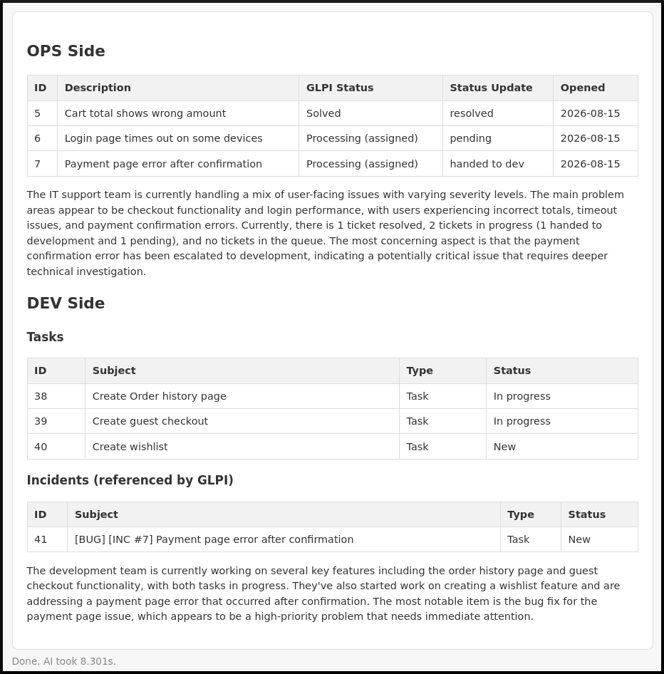
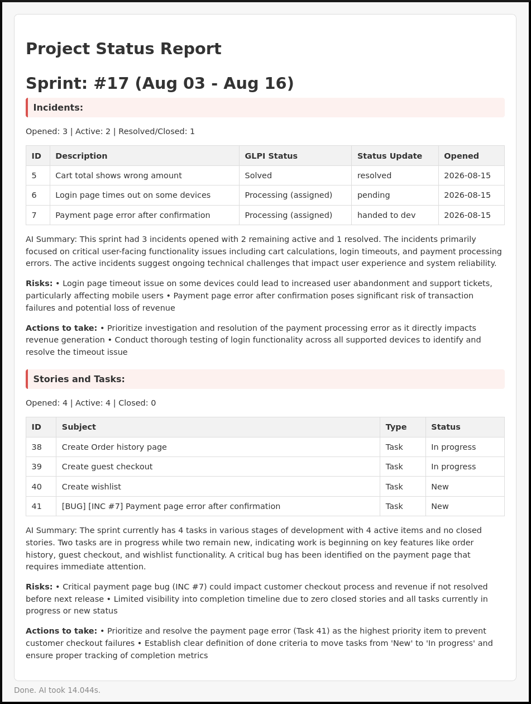
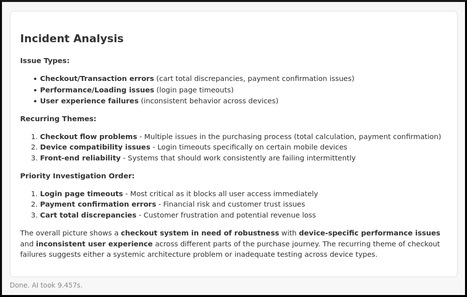
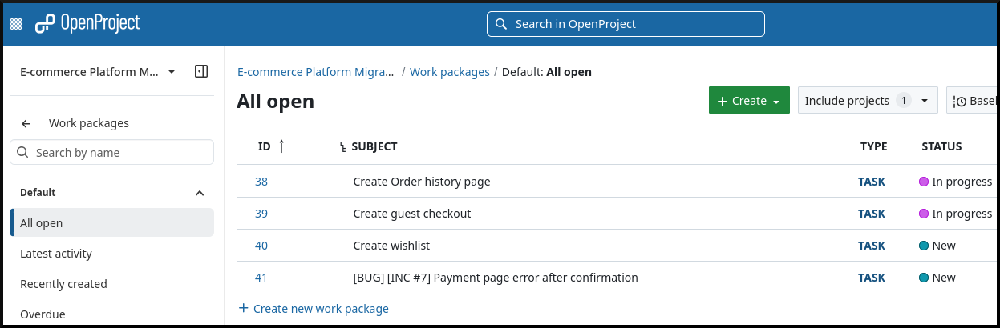
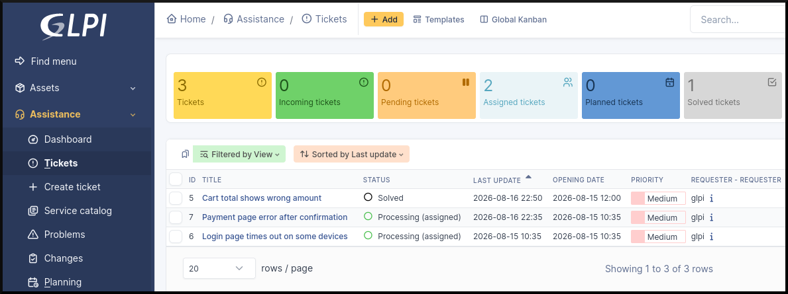
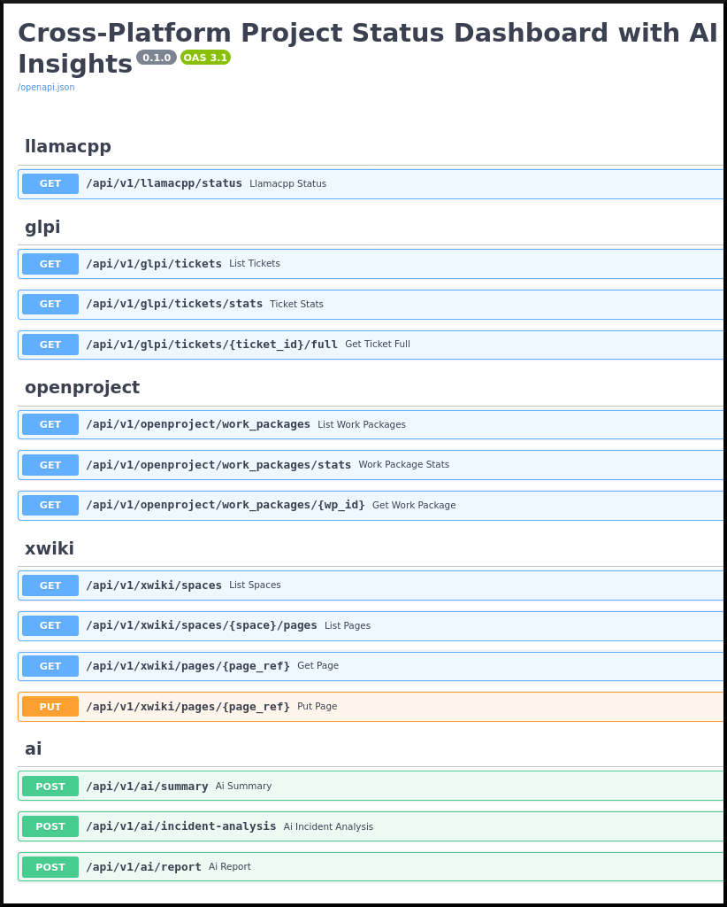

# Cross-Platform Project & Ops Dashboard with AI Insights

### Technologies Used


### Table of Contents
- [Technologies Used](#technologies-used)
- [Project Definition](#project-definition)
  - [Cross-Platform Project & Ops Dashboard with AI Insights](#cross-platform-project--ops-dashboard-with-ai-insights)
  - [Security & Privacy](#security--privacy)
  - [Project Focus & Scenario](#project-focus--scenario)
- [Demo Showcase](#demo-showcase)
  - [Dashboard](#dashboard)
  - [Summary on the Dashboard](#summary-on-the-dashboard)
  - [Project Status Report on the Dashboard](#project-status-report-on-the-dashboard)
  - [Incident analysis on the Dashboard](#incident-analysis-on-the-dashboard)
  - [Example demo Dev tasks on OpenProject](#example-demo-dev-tasks-on-openproject)
  - [Example demo incidents on GLPI](#example-demo-incidents-on-glpi)
  - [FastAPI Status page](#fastapi-status-page)
- [How to start uvicorn](#how-to-start-uvicorn)
- [How It Works — Technical Overview](#how-it-works--technical-overview)
  - [Infrastructure (Ansible)](#infrastructure-ansible)
  - [The API layer (FastAPI backend)](#the-api-layer-fastapi-backend)
  - [The AI layer (llama.cpp)](#the-ai-layer-llamacpp)
    - [How the tables stay accurate](#how-the-tables-stay-accurate)
    - [Status updates that make sense](#status-updates-that-make-sense)
  - [The dashboard](#the-dashboard)
- [Next Plans](#next-plans)

# **PROJECT DEFINITION**
A self-hosted AI-powered management dashboard that connects IT service management, development workflows, and organizational knowledge into a unified operational view. The platform integrates GLPI (incidents and requests), OpenProject (development tasks and project progress), and XWiki (knowledge base) to provide AI-generated summaries, trend analysis, and weekly operational reports. The platform is deployed on a single server using Ansible and developed with FastAPI.

### Security & Privacy
Everything runs **on-premises, on a single server you control** and nothing is sent to the cloud. The AI is a **locally hosted LLM** (llama.cpp), so tickets, tasks, and documents are analyzed entirely on your own hardware, keeping business information private. Secrets (passwords, API tokens) are stored in an encrypted **Ansible Vault**, never in the code or git history.

### Project Focus & Scenario
#### **What is it for?**
The platform is built around a **project manager's daily reality**: keeping a whole project in view without jumping between tools. Instead of opening GLPI for support tickets, OpenProject for development work, and XWiki for documentation separately, the project manager gets **one dashboard** where both sides of the project, operations and development, are monitored together.

#### **The scenario:**
while operations handles incidents in GLPI and developers build features in OpenProject, the project manager can open a single page and see *what is happening right now*. They can see active incidents, tasks in progress, incidents waiting on dev work and get **AI-generated insights** (summaries, incident analysis, and weekly sprint reports) without reading through every ticket or task by hand.

# Demo Showcase:
### Real time usage demo recording: (takes few seconds to load the gif file)
The demo runs on a graphic card with 8GB VRAM  
Model used: Qwen3-Coder with 30 Billion parameters (3B active)  
The script to run llama.cpp alone is from my another project:  
https://github.com/birrkan/llama.cpp-management-gui

### Dashboard:

### Summary on the Dashboard:

### Project Status Report on the Dashboard:

### Incident analysis on the Dashboard:

### Example demo Dev tasks on OpenProject:

### Example demo incidents on GLPI:


### FastAPI Status page:



```
AI Dashboard url: http://<ip address>:3536  
FastAPI url: http://<ip address>:3536/docs  
GLPI url: http://<ip address>:7001  
OpenProject url: http://<ip address>:7003  
XWiki url: http://<ip address>:7002  
```

<!--
## enabling api for glpi:
https://help.glpi-project.org/tutorials/readme-1/api-v2


## glpi id and token
include the id and token in .env file. (rename .env.example to .env)
```
GLPI_CLIENT_ID=
GLPI_CLIENT_SECRET=
GLPI_USERNAME=glpi
GLPI_PASSWORD=glpi
```-->
---  
---  
---  
# **How It Works? Technical Overview**

## Infrastructure (Ansible)

Everything runs on a single server. Instead of configuring the server by hand, **Ansible** provisions it from scratch with reproducible, version-controlled playbooks. Each step is one playbook, each service is one role:

| Playbook | What it does |
|---|---|
| `00-bootstrap` | Creates a dedicated `ansible` user with passwordless sudo + SSH key (no more logging in as root) |
| `01-docker` | Installs Docker Engine + the Docker Compose plugin |
| `02-llamacpp` | Installs the llama.cpp CLI (the local AI engine) from a pinned GitHub release |
| `03-postgres` | Deploys PostgreSQL (with PGVector for future AI memory) as a Docker container |
| `04-glpi` | Deploys GLPI (IT service desk) + its MySQL database via Docker Compose |
| `05-xwiki` | Deploys XWiki (knowledge base) + its MariaDB database |
| `06-openproject` | Deploys OpenProject (project/task management) |

Secrets (passwords, API tokens) live in encrypted **Ansible Vault** so nothing sensitive is committed to git. Running `run-ansible.sh` replays the whole setup on a fresh machine in one command.
```sh
./ansible/establish-ssh-connection.sh # first connection
./ansible/run-ansible.sh
```

## The API layer (FastAPI backend)

The backend is a **Python FastAPI** application. It acts as a single, clean gateway between the dashboard and the three systems the dashboard never talks to GLPI, XWiki, or OpenProject directly.

Every system is integrated through its **official REST API**:
- **GLPI** authenticates via OAuth2, then reads tickets, ticket details, follow-ups (comments), and computes stats (open/active/resolved, urgency breakdown, 14-day trend).
- **OpenProject** authenticates via an API key, then reads work packages (tasks/stories) and computes status/type/project breakdowns.
- **XWiki** authenticates with user credentials, then reads and writes pages **only inside three knowledge-base spaces** (Incident KB, Service Reports, User Documentation). A guard rejects any request outside those folders.

All credentials are loaded from a local `.env` file (gitignored), never hardcoded.

### How to start Uvicorn and serve a FastAPI app?:
```sh
# while in project root:
.venv/bin/uvicorn backend.app.main:app --reload --port 3536
```

## The AI layer (llama.cpp)

The "AI" is a **local, self-hosted LLM** running via **llama.cpp**, no cloud API, no data leaves the server. It serves an OpenAI-compatible endpoint, so the backend calls it like any chat API.

The AI has three actions, each of which gathers real data and asks the model to interpret it:

| Action | What the AI does |
|---|---|
| **Summary** | Reads GLPI tickets + OpenProject tasks and writes a human-language status, split into an **OPS side** (incidents as a table + summary) and a **DEV side** (tasks + incidents handed to dev, as tables + summary). |
| **Incident Analysis** | Reads the actual tickets and analyzes them — recurring themes, common issues, what to investigate first. |
| **Report** | Generates a **sprint report** (taken as last 2 weeks in demo): every incident and dev task listed in tables, with opened/active/closed counts, an AI summary, risks, and recommended actions. |

### How the tables stay accurate

Structured data (tables, counts, statuses) is **built from real API data in code**, not invented by the AI, so it's always correct. The AI is only asked to write the narrative around it (summaries, analysis, risks). This keeps the output reliable and consistent.

### Status updates that make sense

Each incident shows a "Status Update" column that the backend derives deterministically from the ticket's real state:
- GLPI status `Solved`/`Closed` → **resolved**
- Comment mentions a fix → **resolved**
- Comment mentions a handoff to development/engineering → **handed to dev**
- Comment mentions investigation/analysis → **under investigation**
- Comment asks the user for info → **waiting on user**
- No comment, no handoff → **pending**

And when an OpenProject task references an incident (e.g. `[BUG] [INC #7] ...`), the dashboard links them — the OPS side shows "handed to dev" and the DEV side lists it under incidents.

## The dashboard

A single lightweight HTML page served by FastAPI at `/`. It has three buttons — one per AI action — and renders the AI's markdown output (tables, bold titles, bullet points) right on the page. No frontend framework, no build step.

# Next Plans

- **Automated scheduled reports** — generate reports at predefined intervals (e.g. a weekly sprint report) and store them in XWiki. Run by a script triggered on a cron job, so the knowledge base always has the latest report without manual clicks.
- **Automatic OpenProject task creation from incidents** — when an incident's comments indicate that development is needed for the issue, the system will detect it and create a corresponding bug task in OpenProject automatically.
- **SOPs for recurring incidents** — when the AI detects that the same kind of incident keeps reappearing, generate a standard operating procedure (SOP) and store it in the knowledge base, so the team handles it the same way every time.
