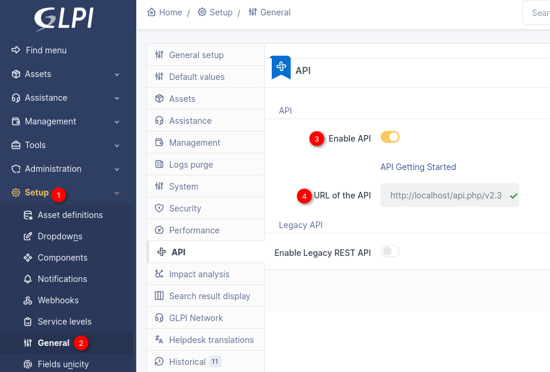
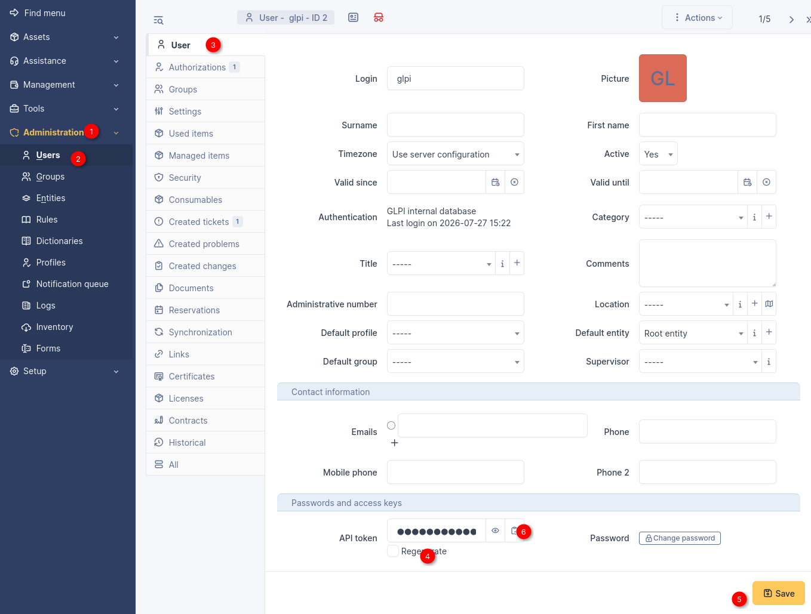

## Technologies Used


# PROJECT DEFINITION
# Cross-Platform Project & Ops Dashboard with AI Insights:
A self-hosted AI-powered management dashboard that connects IT service management, development workflows, and organizational knowledge into a unified operational view. The platform integrates GLPI (incidents and requests), OpenProject (development tasks and project progress), and XWiki (knowledge base) to provide AI-generated summaries, trend analysis, and weekly operational reports. A locally hosted LLM analyzes data from connected systems while keeping business information private. The platform is deployed on a single server using Ansible and developed with FastAPI.


## how to start FASTAPI:
```
# while in project root:
.venv/bin/uvicorn backend.app.main:app --reload --port 3536
```

## enabling api for glpi:
https://help.glpi-project.org/tutorials/readme-1/api-v2



## glpi id and token
include the id and token in .env file. (rename .env.example to .env)
```
GLPI_CLIENT_ID=
GLPI_CLIENT_SECRET=
GLPI_USERNAME=glpi
GLPI_PASSWORD=glpi
```


### MVP goal example:
Company Status  
────────────────────────  
IT Support  
Open incidents:  
23  

Main issues:  
Authentication failures  

AI Summary:  
e.g. Most incidents originate from the latest application update.  
────────────────────────  
Development  
Active tasks:  
18  

Tasks summary:

Sprint progress:  
72%  

AI Summary:  
e.g. Authentication bug is blocking release.  
────────────────────────  
Risks  

⚠ Database migration delayed  
⚠ Increasing ticket volume  
⚠ 2 critical bugs unresolved
